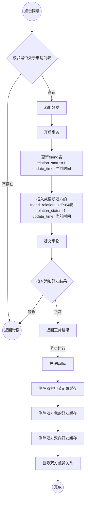
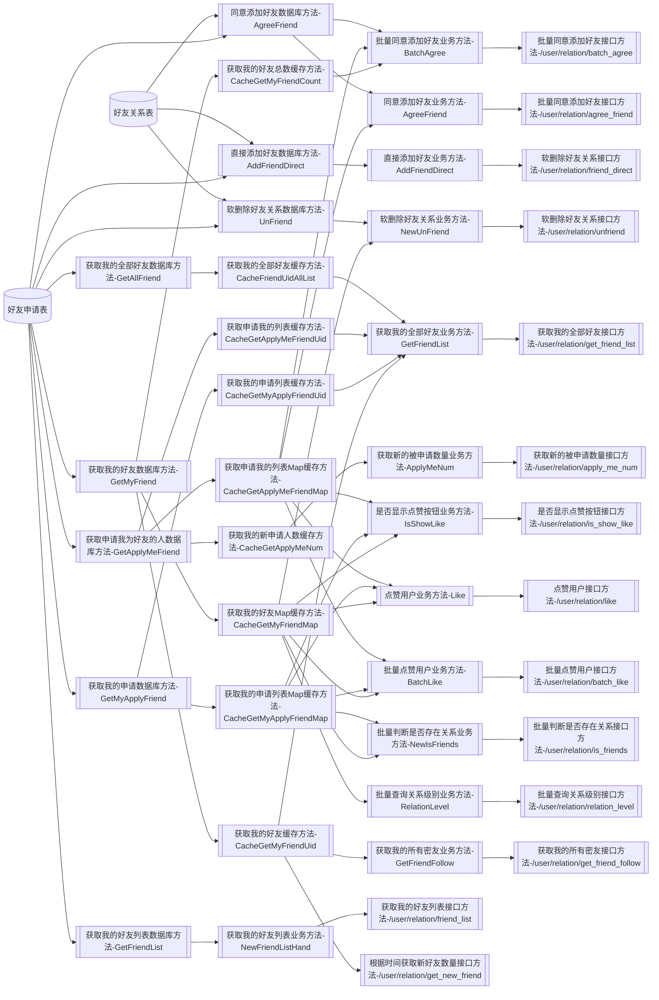
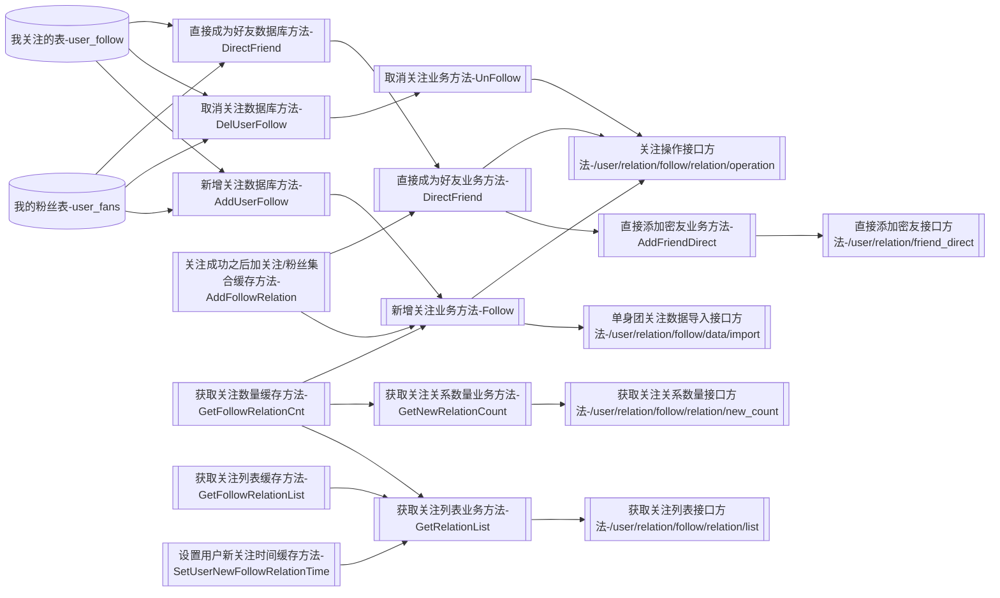

# 好友系统设计

## 数据库设计

### 好友关系表结构 分表根据uid取模分表，用户的所有好友都在同一个表内

```mysql
CREATE TABLE `friend_relation_0` (
  `id` int(11) unsigned NOT NULL AUTO_INCREMENT,
  `uid` int(11) NOT NULL COMMENT '用户uid',
  `friend_uid` int(11) NOT NULL COMMENT '好友uid',
  `apply_status` tinyint(4) NOT NULL DEFAULT '1' COMMENT '1:uid主动申请  2：好友主动申请',
  `relation_status` tinyint(4) NOT NULL DEFAULT '0' COMMENT '关系状态0=>申请中、1=>关系确立',
  `create_time` int(11) NOT NULL COMMENT '申请时间',
  `update_time` int(11) NOT NULL COMMENT '更新时间',
  PRIMARY KEY (`id`),
  UNIQUE KEY `idx_uid_frienduid` (`uid`,`friend_uid`),
  KEY `idx_uid_frienduid_applystatus` (`uid`,`friend_uid`,`apply_status`)
) ENGINE=InnoDB AUTO_INCREMENT=17301 DEFAULT CHARSET=utf8mb4 COLLATE=utf8mb4_unicode_ci COMMENT='好友关系表';
```

### 好友申请表结构

```mysql
CREATE TABLE `friend` (
  `id` bigint(20) unsigned NOT NULL AUTO_INCREMENT COMMENT '主键ID',
  `uid_apply` bigint(20) unsigned NOT NULL COMMENT '主动发起用户ID',
  `uid_follow` bigint(20) unsigned NOT NULL COMMENT '被动用户ID',
  `relation_status` tinyint(8) NOT NULL DEFAULT '0' COMMENT '关系状态0=>申请中、1=>关系确立',
  `is_del` tinyint(1) NOT NULL DEFAULT '0' COMMENT '是否被删除',
  `create_time` int(11) unsigned NOT NULL DEFAULT '0' COMMENT '添加为好友时间',
  `update_time` int(11) unsigned NOT NULL DEFAULT '0' COMMENT '好友关系修改时间',
  PRIMARY KEY (`id`),
  KEY `uid_apply` (`uid_apply`),
  KEY `uid_follow` (`uid_follow`)
) ENGINE=InnoDB AUTO_INCREMENT=230357 DEFAULT CHARSET=utf8 COLLATE=utf8_bin COMMENT='关系表';
```

### 我喜欢的表结构 分表根据uid取模

```mysql
CREATE TABLE `my_like_00` (
  `id` bigint(20) unsigned NOT NULL AUTO_INCREMENT COMMENT '主键ID',
  `uid` bigint(20) unsigned NOT NULL COMMENT '用户ID',
  `to_uid` bigint(20) unsigned NOT NULL COMMENT '被点赞用户ID',
  `context` varchar(255) COLLATE utf8mb4_unicode_ci NOT NULL DEFAULT '' COMMENT '点赞文本',
  `hidden` tinyint(4) unsigned NOT NULL DEFAULT '0' COMMENT '是否隐藏, 1:隐藏,0:不隐藏',
  `create_time` int(11) unsigned NOT NULL DEFAULT '0',
  `update_time` int(11) unsigned NOT NULL DEFAULT '0',
  PRIMARY KEY (`id`),
  UNIQUE KEY `uid_to_uid` (`uid`,`to_uid`),
  KEY `user_hidden` (`uid`,`hidden`)
) ENGINE=InnoDB AUTO_INCREMENT=20666 DEFAULT CHARSET=utf8mb4 COLLATE=utf8mb4_unicode_ci COMMENT='我点赞的记录表';
```

### 喜欢我的表结构 分表根据uid取模

```mysql
CREATE TABLE `like_me_00` (
  `id` bigint(20) unsigned NOT NULL AUTO_INCREMENT COMMENT '主键ID',
  `uid` bigint(20) unsigned NOT NULL COMMENT '用户ID',
  `to_uid` bigint(20) unsigned NOT NULL COMMENT '被点赞用户ID',
  `context` varchar(255) COLLATE utf8mb4_unicode_ci NOT NULL DEFAULT '' COMMENT '点赞文本',
  `hidden` tinyint(4) unsigned NOT NULL DEFAULT '0' COMMENT '是否隐藏, 1:隐藏,0:不隐藏',
  `create_time` int(11) unsigned NOT NULL DEFAULT '0',
  `update_time` int(11) unsigned NOT NULL DEFAULT '0',
  PRIMARY KEY (`id`),
  UNIQUE KEY `to_uid_uid` (`to_uid`,`uid`),
  KEY `user_hidden` (`to_uid`,`hidden`)
) ENGINE=InnoDB AUTO_INCREMENT=20588 DEFAULT CHARSET=utf8mb4 COLLATE=utf8mb4_unicode_ci COMMENT='点赞我的记录表';
```

### 我关注的表结构 分表根据uid取模

```mysql
CREATE TABLE `user_follow_0` (
  `id` int(11) unsigned NOT NULL AUTO_INCREMENT,
  `uid` int(11) NOT NULL COMMENT 'uid',
  `to_uid` int(11) NOT NULL COMMENT '被关注uid',
  `friend_status` tinyint(4) NOT NULL COMMENT '好友状态 0:非好友  1：好友',
  `ctime` bigint(20) NOT NULL COMMENT '关注时间',
  `utime` bigint(20) NOT NULL COMMENT '好友时间，取消好友时间',
  PRIMARY KEY (`id`),
  UNIQUE KEY `unique_uid_toUid` (`uid`,`to_uid`),
  KEY `idx_uid_ctime` (`uid`,`ctime`),
  KEY `idx_uid_friendStatus_utime` (`uid`,`friend_status`,`utime`)
) ENGINE=InnoDB AUTO_INCREMENT=9273 DEFAULT CHARSET=utf8mb4 COLLATE=utf8mb4_unicode_ci COMMENT='关注关系';
```

### 我的粉丝（关注我的）表结构 分表根据uid取模

```mysql
CREATE TABLE `user_fans_0` (
  `id` int(11) unsigned NOT NULL AUTO_INCREMENT,
  `uid` int(11) NOT NULL COMMENT 'uid',
  `to_uid` int(11) NOT NULL COMMENT '粉丝uid',
  `friend_status` tinyint(4) NOT NULL COMMENT '好友状态 0:非好友  1：好友',
  `shield_status` tinyint(4) unsigned NOT NULL DEFAULT '0' COMMENT '屏蔽状态 0正常 1已重置 2 已注销 ',
  `ctime` bigint(20) NOT NULL COMMENT '粉丝时间',
  `utime` bigint(20) NOT NULL COMMENT '好友时间，取消好友时间',
  PRIMARY KEY (`id`),
  UNIQUE KEY `unique_uid_toUid` (`uid`,`to_uid`),
  KEY `idx_uid_ctime` (`uid`,`ctime`),
  KEY `idx_uid_friendStatus_utime` (`uid`,`friend_status`,`utime`)
) ENGINE=InnoDB AUTO_INCREMENT=9203 DEFAULT CHARSET=utf8mb4 COLLATE=utf8mb4_unicode_ci COMMENT='粉丝关系';
```


## 流程图

申请好友流程图


同意好友流程图



### 接口与方法与表关系图

好友申请表与接口关系图



我关注的表与接口关系图




