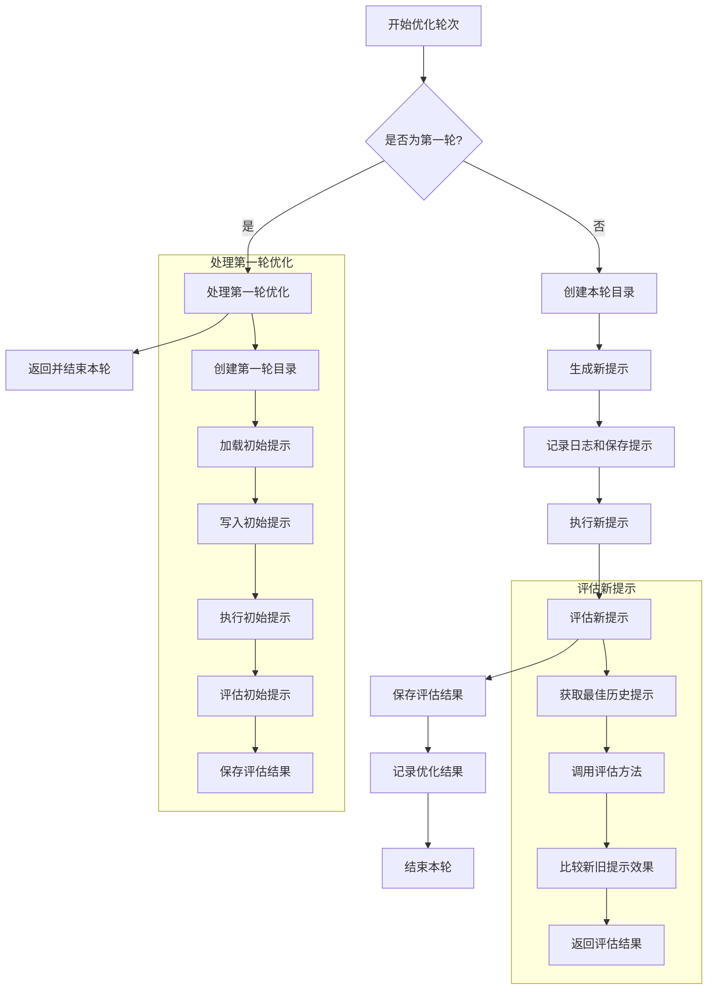

# 利用ai实现提示词生成原理解析
## 分析dify的提示词生成源代码
### 核心函数介绍
- `PromptTemplateParser` 类主要负责处理模板字符串中的变量替换，核心功能如下：

  1. 模板变量规则 ：
      - 变量必须用 {{}} 包裹
      - 变量名只能包含字母、数字和下划线，最大长度30个字符
      - 变量名必须以字母或下划线开头
      - 支持三种特殊变量： {{#histories#}} 、 {{#query#}} 、 {{#context#}}
  2. 主要方法 ：
      - `extract` ：从模板中提取所有变量
      - `format` ：将输入的变量值替换到模板中
  3. 工作流程 ：
      ```plaintext
         1. 初始化时传入模板字符串
         2. 使用正则表达式提取模板中的所有变量
         3. 当调用 format 方法时：
            - 接收一个变量值的字典
            - 遍历模板中的变量
            - 用字典中对应的值替换变量
            - 如果字典中没有对应的值，保留原始变量
      ```
  4. 举个例子：
      ```python
      template = "Hello {{name}}, welcome to {{place}}!"
      parser = PromptTemplateParser(template)
      result = parser.format({"name": "Alice", "place": "Wonderland"})
      # 输出: "Hello Alice, welcome to Wonderland!"
      ```
     
- 提示词模版设定
  1. 无变量模版介绍 ：
        - WORKFLOW_RULE_CONFIG_PROMPT_GENERATE_TEMPLATE 是一个预定义的提示模板
        - 模板要求 AI 根据任务描述创建一个结构化的提示模板
        - 生成的提示模板需要包含清晰的指令、相关示例等
        - 输出格式要求使用 XML 标签进行结构化
        - ```python
          WORKFLOW_RULE_CONFIG_PROMPT_GENERATE_TEMPLATE = """
          Here is a task description for which I would like you to create a high-quality prompt template for:
          <task_description>
          {{TASK_DESCRIPTION}}
          </task_description>
          Based on task description, please create a well-structured prompt template that another AI could use to consistently complete the task. The prompt template should include:
          Do not include <input> or <output> section and variables in the prompt, assume user will add them at their own will.
          Clear instructions for the AI that will be using this prompt, demarcated with <instructions> tags. The instructions should provide step-by-step directions on how to complete the task using the input variables. Also Specifies in the instructions that the output should not contain any xml tag.
          Relevant examples if needed to clarify the task further, demarcated with <example> tags. Do not include variables in the prompt. Give three pairs of input and output examples.
          Include other relevant sections demarcated with appropriate XML tags like <examples>, <instructions>.
          Use the same language as task description.
          Output in ``` xml ``` and start with <instruction>
          Please generate the full prompt template with at least 300 words and output only the prompt template.
          """
          ```
        - ```plaintext
            中文翻译：
            我想请你为以下任务描述创建一个高质量的提示模板：
            <task_description>
            {{TASK_DESCRIPTION}}
            </task_description>
            基于任务描述，请创建一个结构良好的提示模板，使其他 AI 能够一致地完成任务。提示模板应包含：
            用 {{ }} （两个花括号）包围的描述性变量名，用于指示实际值将在何处替换。选择能清楚表明预期值类型的变量名。变量名只能由数字、英文字母和下划线组成，不能包含其他字符。
            用 <instructions> 标签标记的清晰指令。这些指令应该提供使用输入变量完成任务的步骤说明。同时需要指明输出不应包含任何 xml 标签。
            用 <example> 标签标记的相关示例（如果需要进一步说明任务）。除了 <instruction> 部分外，不要在其他地方使用花括号。
            用适当的 XML 标签（如 <input>、<output> 等）标记的其他相关部分。
            使用与任务描述相同的语言。
            以 <instruction> 开头，用 ``` xml ``` 格式输出。
            请生成完整的提示模板，并且只输出提示模板本身。
         ```
  2. 有变量模版介绍
      1. RULE_CONFIG_PROMPT_GENERATE_TEMPLATE ：
          - 目的：生成包含变量的结构化提示模板
          - 特点：
            - 要求变量使用 {{ }} 包裹
            - 变量名只能包含数字、英文字母和下划线
            - 输出必须是 XML 格式
            - 保持与任务描述相同的语言
            - ```python
                # 包含<instructions> 、 <example> 、 <input> 、 <output>等标签
                  RULE_CONFIG_PROMPT_GENERATE_TEMPLATE = """
                  Here is a task description for which I would like you to create a high-quality prompt template for:
                  <task_description>
                  {{TASK_DESCRIPTION}}
                  </task_description>
                  Based on task description, please create a well-structured prompt template that another AI could use to consistently complete the task. The prompt template should include:
                  - Descriptive variable names surrounded by {{ }} (two curly brackets) to indicate where the actual values will be substituted in. Choose variable names that clearly indicate the type of value expected. Variable names have to be composed of number, english alphabets and underline and nothing else. 
                  - Clear instructions for the AI that will be using this prompt, demarcated with <instructions> tags. The instructions should provide step-by-step directions on how to complete the task using the input variables. Also Specifies in the instructions that the output should not contain any xml tag. 
                  - Relevant examples if needed to clarify the task further, demarcated with <example> tags. Do not use curly brackets any other than in <instruction> section. 
                  - Any other relevant sections demarcated with appropriate XML tags like <input>, <output>, etc.
                  - Use the same language as task description. 
                  - Output in ``` xml ``` and start with <instruction>
                  Please generate the full prompt template and output only the prompt template.
                  """
                ```
            - ```plaintext
                  中文翻译：
                    我想请你为以下任务描述创建一个高质量的提示模板：
                    <task_description>
                    {{TASK_DESCRIPTION}}
                    </task_description>
                    基于任务描述，请创建一个结构良好的提示模板，使其他 AI 能够一致地完成任务。提示模板应包含：
                    用 {{ }} （两个花括号）包围的描述性变量名，用于指示实际值将在何处替换。选择能清楚表明预期值类型的变量名。变量名只能由数字、英文字母和下划线组成，不能包含其他字符。
                    用 <instructions> 标签标记的清晰指令。这些指令应该提供使用输入变量完成任务的步骤说明。同时需要指明输出不应包含任何 xml 标签。
                    用 <example> 标签标记的相关示例（如果需要进一步说明任务）。除了 <instruction> 部分外，不要在其他地方使用花括号。
                    用适当的 XML 标签（如 <input>、<output> 等）标记的其他相关部分。
                    使用与任务描述相同的语言。
                    以 <instruction> 开头，用 ``` xml ``` 格式输出。
                    请生成完整的提示模板，并且只输出提示模板本身。
               ```
        
      2. RULE_CONFIG_PARAMETER_GENERATE_TEMPLATE ：
         - 目的：从输入文本中提取变量名
         - 工作流程：
             - 读取并理解输入文本
             - 提取相关参数
             - 将参数转换为 JSON 格式
             - 输出变量名列表
         - 输出格式： ["variable_name_1", "variable_name_2"]
         - 特点：只输出变量名列表，不包含其他内容
         - ```python
                  RULE_CONFIG_PARAMETER_GENERATE_TEMPLATE = """
                  I need to extract the following information from the input text. The <information to be extracted> tag specifies the 'type', 'description' and 'required' of the information to be extracted. 
                  <information to be extracted>
                  variables name bounded two double curly brackets. Variable name has to be composed of number, english alphabets and underline and nothing else. 
                  </information to be extracted>

                  Step 1: Carefully read the input and understand the structure of the expected output.
                  Step 2: Extract relevant parameters from the provided text based on the name and description of object. 
                  Step 3: Structure the extracted parameters to JSON object as specified in <structure>.
                  Step 4: Ensure that the list of variable_names is properly formatted and valid. The output should not contain any XML tags. Output an empty list if there is no valid variable name in input text. 

                  ### Structure
                  Here is the structure of the expected output, I should always follow the output structure. 
                  ["variable_name_1", "variable_name_2"]

                  ### Input Text
                  Inside <text></text> XML tags, there is a text that I should extract parameters and convert to a JSON object.
                  <text>
                  {{INPUT_TEXT}}
                  </text>

                  ### Answer
                  I should always output a valid list. Output nothing other than the list of variable_name. Output an empty list if there is no variable name in input text.
                  """
           ```
           - ```plaintext
                  中文翻译：
                    我需要从输入文本中提取以下信息。<information to be extracted> 标签指定了需要提取的信息的"类型"、"描述"和"是否必需"。
                    <information to be extracted>
                    由两个花括号包围的变量名。变量名必须仅由数字、英文字母和下划线组成，不能包含其他字符。
                    </information to be extracted>
                    
                    步骤 1：仔细阅读输入并理解预期输出的结构。
                    步骤 2：根据对象的名称和描述从提供的文本中提取相关参数。
                    步骤 3：按照 <structure> 中指定的格式将提取的参数构造成 JSON 对象。
                    步骤 4：确保变量名列表格式正确且有效。输出不应包含任何 XML 标签。如果输入文本中没有有效的变量名，则输出空列表。
                    
                    ### 结构
                    这是预期输出的结构，我应该始终遵循这个输出结构：
                    ["variable_name_1", "variable_name_2"]
                    
                    ### 输入文本
                    在 <text></text> XML 标签内，有一段需要提取参数并转换为 JSON 对象的文本。
                    <text>
                    {{INPUT_TEXT}}
                    </text>
                    
                    ### 答案
                    我应该始终输出一个有效的列表。除了变量名列表外不要输出其他内容。如果输入文本中没有变量名，则输出空列表。
             ```
      3. RULE_CONFIG_STATEMENT_GENERATE_TEMPLATE ：
         - 目的：生成聊天机器人的开场白
         - 工作流程：
             - 从任务描述中识别机器人的目的
             - 推断机器人的语气（友好、专业等）
             - 创建连贯且吸引人的开场白
         - 特点：
             - 根据用户输入语言自动切换（中文/英文）
             - 不包含 XML 标签
             - 包含欢迎语和功能说明
               这三个模板在 generate_rule_config 函数中配合使用：
         - ```python
                  RULE_CONFIG_STATEMENT_GENERATE_TEMPLATE = """
                  <instruction>
                  Step 1: Identify the purpose of the chatbot from the variable {{TASK_DESCRIPTION}} and infer chatbot's tone  (e.g., friendly, professional, etc.) to add personality traits. 
                  Step 2: Create a coherent and engaging opening statement.
                  Step 3: Ensure the output is welcoming and clearly explains what the chatbot is designed to do. Do not include any XML tags in the output.
                  Please use the same language as the user's input language. If user uses chinese then generate opening statement in chinese,  if user uses english then generate opening statement in english. 
                  Example Input: 
                  Provide customer support for an e-commerce website
                  Example Output: 
                  Welcome! I'm here to assist you with any questions or issues you might have with your shopping experience. Whether you're looking for product information, need help with your order, or have any other inquiries, feel free to ask. I'm friendly, helpful, and ready to support you in any way I can.
                  <Task>
                  Here is the task description: {{INPUT_TEXT}}

                  You just need to generate the output
                  """ 
           ```
         - ```plaintext
                中文翻译：
                  <instruction>
                  步骤 1：从变量 {{TASK_DESCRIPTION}} 中识别聊天机器人的目的，并推断其语气（例如：友好的、专业的等）以添加个性特征。
                  步骤 2：创建一个连贯且吸引人的开场白。
                  步骤 3：确保输出内容友好且清晰地解释聊天机器人的功能。输出中不要包含任何 XML 标签。
                    
                  请使用与用户输入相同的语言。如果用户使用中文则生成中文开场白，如果用户使用英文则生成英文开场白。
                    
                  示例输入：
                  为电子商务网站提供客户支持
                    
                  示例输出：
                  欢迎！我很乐意为您解答任何购物相关的问题。无论您是需要产品信息、订单帮助，还是有其他疑问，都可以随时询问。我会以友好、专业的态度为您提供全方位的支持。
                    
                  <Task>
                  这是任务描述：{{INPUT_TEXT}}
                    
                  您只需要生成输出内容
           ```  
  3.
      1. 第一个模板生成主要的提示结构
      2. 第二个模板从生成的提示中提取变量
      3. 第三个模板生成开场白
         它们共同构成了一个完整的规则配置生成系统。

- `generate_rule_config` 函数的工作流程：
  1. 初始化阶段 ：
      - 创建一个 rule_config 字典，包含 prompt、variables、opening_statement 和 error 字段
      - 设置模型参数，包括 max_tokens 和较低的 temperature（0.01）以确保输出的稳定性
  - 当 no_variable=True 时的处理流程 ：
      - 使用 PromptTemplateParser 处理 WORKFLOW_RULE_CONFIG_PROMPT_GENERATE_TEMPLATE 模板
      - 将用户的 instruction 插入到模板中的 {{TASK_DESCRIPTION}} 位置
      - 调用 LLM 模型生成响应
      - 将生成的内容保存到 rule_config["prompt"] 中

  - 当 no_variable=False 时的处理逻辑：
    1. 获取格式指令 ：
       ```python
       #从 RuleConfigGeneratorOutputParser 获取三个不同的模板：
       #prompt_generate：用于生成主要提示
       #parameter_generate：用于生成变量
       #statement_generate：用于生成开场白
       prompt_generate, parameter_generate, statement_generate = output_parser.get_format_instructions()
       ```
    2. 创建三个模板解析器 ：
       ```python
       prompt_template = PromptTemplateParser(prompt_generate)
       parameter_template = PromptTemplateParser(parameter_generate)
       statement_template = PromptTemplateParser(statement_generate)
        ```

    3. 三步生成过程 ：
       1. 第一步 - 生成主提示 ：
          ```python
          prompt_generate_prompt = prompt_template.format(
              inputs={"TASK_DESCRIPTION": instruction},
              remove_template_variables=False,
          )
          prompt_content = model_instance.invoke_llm(...)
          rule_config["prompt"] = prompt_content.message.content
           ```
       2. 第二步 - 生成变量 ：
           ```python
           parameter_generate_prompt = parameter_template.format(
               inputs={"INPUT_TEXT": prompt_content.message.content},
               remove_template_variables=False,
           )
           parameter_content = model_instance.invoke_llm(...)
           rule_config["variables"] = re.findall(r'"\s*([^"]+)\s*"', parameter_content.message.content)
           ```
       3. 第三步 - 生成开场白 ：
          ```python
          statement_generate_prompt = statement_template.format(
              inputs={
                  "TASK_DESCRIPTION": instruction,
                  "INPUT_TEXT": prompt_content.message.content,
              },
              remove_template_variables=False,
          )
          statement_content = model_instance.invoke_llm(...)
          rule_config["opening_statement"] = statement_content.message.content
           ```
  - 与 no_variable=True 的情况相比，这种模式：
    1. 生成更复杂的规则配置，包含变量和开场白
    2. 需要多次调用 LLM 模型（三次）
    3. 每一步的输出会作为下一步的输入
    4. 最终生成的 rule_config 包含完整的 prompt、variables 和 opening_statement
       每个步骤都有独立的错误处理，如果任何步骤失败，都会记录相应的错误信息。


## metaSPO 源代码分析

### 相关文件和变量解释

#### 1. `Poem.yaml` 文件解释

##### 功能概述
`Poem.yaml` 是一个配置文件，用于定义生成诗歌的任务。它包含提示（prompt）、要求（requirements）、字数限制（count）以及问题-答案对（qa）。这些信息用于指导 LLM 模型生成符合要求的诗歌。

##### 文件结构
```yaml
prompt: |
  Create poetry in the requested style and format.

requirements: |
  None

count: None

qa:
  - question: |
      Write a modern sonnet about climate change
    answer: |
      None

  - question: |
      Create a haiku series about New York City
    answer: |
      None

  - question: |
      Write a free verse poem about social media
    answer: |
      None
```


##### 详细字段说明
- **`prompt`**：定义了任务的基本提示，指示模型创建符合请求风格和格式的诗歌。
- **`requirements`**：当前没有具体的要求（设置为 `None`），意味着任务较为开放，不附加额外约束。
- **`count`**：当前没有字数限制（设置为 `None`），意味着生成的诗歌长度不受限制。
- **`qa`**：包含多个问题-答案对，每个问题是一个具体的诗歌创作任务，答案部分目前为空（设置为 `None`），表示尚未生成或提供标准答案。

#### 2. `optimize_prompt.py` 文件解释

##### 功能概述
`optimize_prompt.py` 定义了一个优化提示模板 (`PROMPT_OPTIMIZE_PROMPT`)，用于指导 LLM 模型优化现有提示。该模板包含了任务要求、参考提示、执行结果和期望的最佳答案，并要求模型分析现有结果的不足并提出改进建议。

##### 关键代码片段
```python
PROMPT_OPTIMIZE_PROMPT = """
You are building a prompt to address user requirement. Based on the given prompt, 
please reconstruct and optimize it. You can add, modify, or delete prompts. Please include a single modification in 
XML tags in your reply. During the optimization, you can incorporate any thinking models.
This is a prompt that performed excellently in a previous iteration. You must make further optimizations and improvements based on this prompt. The modified prompt must differ from the provided example.

requirements:
```

{requirements}
```
reference prompt:
```

{prompt}
```
The execution result of this reference prompt is(some cases):
```

{answers}
```
The best answer we expect(some cases):
```

{golden_answers}
```
Provide your analysis, optimization points, and the complete optimized prompt using the following XML format:

<analyse>Analyze what drawbacks exist in the results produced by the reference prompt and how to improve them.</analyse>
<modification>Summarize the key points for improvement in one sentence</modification>
<prompt>Provide the complete optimized prompt {count}</prompt>
"""
```


##### 详细字段说明
- **`requirements`**：用户的具体要求，作为优化的依据。
- **`prompt`**：需要优化的参考提示。
- **`answers`**：参考提示的执行结果，帮助识别现有提示的问题。
- **`golden_answers`**：期望的最佳答案，作为优化的目标。
- **`analyse`**：要求模型分析现有结果的不足之处。
- **`modification`**：要求模型总结改进的关键点。
- **`prompt`**：要求模型提供完整的优化后提示。

#### 3. `evaluate_prompt.py` 文件解释

##### 功能概述
`evaluate_prompt.py` 定义了一个评估提示模板 (`EVALUATE_PROMPT`)，用于指导 LLM 模型比较两个不同提示及其答案的质量，并选择更优的一个。该模板包含了任务要求、两个样本（A 和 B）、参考答案，并要求模型进行分析和选择。

##### 关键代码片段
```python
EVALUATE_PROMPT = """
Based on the original requirements, evaluate the two responses, A and B, and determine which one better meets the requirements. If a reference answer is provided, strictly follow the format/content of the reference answer.

# Requirement
{requirement}

# A
{sample}

# B
{new_sample}

# Golden answer
{answers}

Provide your analysis and the choice you believe is better, using XML tags to encapsulate your response.

<analyse>Some analysis</analyse>
<choose>A/B (the better answer in your opinion)</choose>
"""
```


##### 详细字段说明
- **`requirement`**：原始任务要求，作为评估的依据。
- **`sample`**：第一个样本（A），即之前的提示及其答案。
- **`new_sample`**：第二个样本（B），即新生成的提示及其答案。
- **`answers`**：参考答案，作为评估的标准。
- **`analyse`**：要求模型分析两个样本的优劣。
- **`choose`**：要求模型选择更优的样本（A 或 B）。

### `_optimize_prompt` 函数流程图

为了更清晰地展示 `_optimize_prompt` 函数的执行流程，以下是基于其逻辑绘制的详细流程图：



### `_optimize_prompt` 函数逻辑详细解释

`_optimize_prompt` 是 `PromptOptimizer` 类中的一个异步函数，用于执行每个优化轮次的核心逻辑。以下是该函数的详细步骤拆分：

#### 1. 加载已有数据
```python
prompt_path = self.root_path / "prompts"
load.set_file_name(self.template)
data = self.data_utils.load_results(prompt_path)
```

- **说明**：设置当前优化任务的模板文件名，并加载之前轮次的结果数据。
- **作用**：确保每次优化时都能基于历史数据进行改进。

#### 2. 处理第一轮优化
```python
if self.round == 1:
    await self._handle_first_round(prompt_path, data)
    return
```

- **说明**：如果当前是第一轮优化，则调用 `_handle_first_round` 方法处理初始轮次。
- **作用**：初始化优化过程，创建第一个版本的提示并评估其效果。

#### 3. 创建本轮目录
```python
directory = self.prompt_utils.create_round_directory(prompt_path, self.round)
new_prompt = await self._generate_optimized_prompt()
self.prompt = new_prompt
```

- **说明**：为当前轮次创建一个新的目录，并生成优化后的提示。
- **作用**：确保每一轮优化都有独立的工作空间，并生成新的提示以供测试。

#### 4. 记录日志和保存提示
```python
logger.info(f"\nRound {self.round} Prompt: {self.prompt}\n")
self.prompt_utils.write_prompt(directory, prompt=self.prompt)
```

- **说明**：记录当前轮次的提示内容，并将其写入文件。
- **作用**：便于后续查看和调试，同时确保提示可以持久化保存。

#### 5. 执行新提示
```python
success, answers = await self._evaluate_new_prompt(prompt_path, data, directory)
```

- **说明**：调用 `_evaluate_new_prompt` 方法来执行新生成的提示，并评估其效果。
- **作用**：通过实际运行新提示，收集结果并评估其性能。

#### 6. 记录优化结果
```python
self._log_optimization_result(success)
```

- **说明**：根据评估结果记录优化是否成功。
- **作用**：提供清晰的日志输出，帮助理解优化过程的效果。

### `_evaluate_new_prompt` 函数逻辑详细解释

`_evaluate_new_prompt` 函数负责执行新生成的提示，并对其进行评估。以下是该函数的详细步骤拆分：

#### 1. 执行新提示
```python
logger.info("\n⚡ RUNNING OPTIMIZED PROMPT ⚡\n")
new_samples = await self.evaluation_utils.execute_prompt(self, directory)
```

- **说明**：记录日志并执行新生成的提示。
- **作用**：实际运行新提示，获取其输出结果。

#### 2. 评估新提示
```python
logger.info("\n📊 EVALUATING OPTIMIZED PROMPT 📊\n")
samples = self.data_utils.get_best_round()
success, answers = await self.evaluation_utils.evaluate_prompt(
    self, samples, new_samples, path=prompt_path, data=data, initial=False
)
```

- **说明**：记录日志并调用 `evaluate_prompt` 方法对新提示进行评估。
- **作用**：比较新提示与最佳历史提示的表现，确定新提示是否更优。

#### 3. 保存答案
```python
self.prompt_utils.write_answers(directory, answers=answers)
```

- **说明**：将评估结果（答案）保存到文件中。
- **作用**：确保评估结果可以持久化保存，便于后续分析和参考。

#### 4. 返回评估结果
```python
return success, answers
```

- **说明**：返回评估结果，包括是否成功和具体的答案。
- **作用**：为上层调用者提供评估结果，以便进一步处理或记录。

### `_generate_optimized_prompt` 函数解释

#### 功能概述
`_generate_optimized_prompt` 是 `PromptOptimizer` 类中的一个异步方法，用于生成优化后的新提示（prompt）。该方法在每次优化轮次中调用，通过分析前一轮的最佳结果和一些配置信息来生成新的提示。

#### 详细步骤
1. **加载元数据**：
    - 使用 `load.load_meta_data()` 加载配置文件中的要求 (`requirements`)、问题-答案对 (`qa`) 和字数限制 (`count`)。

2. **获取最佳轮次的结果**：
    - 调用 `self.data_utils.get_best_round()` 获取之前轮次中表现最好的结果。这包括最佳轮次的提示 (`samples["prompt"]`) 和其对应的答案 (`samples["answers"]`)。

3. **日志记录**：
    - 记录当前轮次的优化开始信息，并指定使用的是哪一轮的最佳结果作为基础。

4. **将问题-答案对转换为 Markdown 格式**：
    - 使用 `self.data_utils.list_to_markdown(qa)` 将问题-答案对转换为 Markdown 格式的字符串 (`golden_answer`)。
    - 同样地，将最佳轮次的答案转换为 Markdown 格式的字符串 (`best_answer`)。

5. **构建优化提示模板**：
    - 使用 `PROMPT_OPTIMIZE_PROMPT.format(...)` 构建优化提示的模板。这个模板包含了以下内容：
        - 当前轮次的最佳提示 (`samples["prompt"]`)
        - 最佳轮次的答案 (`best_answer`)
        - 配置文件中的要求 (`requirements`)
        - 问题-答案对的黄金标准 (`golden_answer`)
        - 字数限制 (`count`)

6. **发送请求给 LLM 模型**：
    - 使用 `await self.llm.responser(...)` 向 LLM 模型发送优化提示模板，请求模型生成新的优化后的提示。
    - 提取响应中的修改建议 (`modification`) 和新提示 (`prompt`)。

7. **返回新提示**：
    - 如果从响应中成功提取了新提示，则返回该提示；否则返回空字符串。

#### 关键代码片段
```python
async def _generate_optimized_prompt(self):
    _, requirements, qa, count = load.load_meta_data()
    samples = self.data_utils.get_best_round()

    logger.info(f"\n🚀 Round {self.round} OPTIMIZATION STARTING 🚀\n")
    logger.info(f"\nSelecting prompt for round {samples['round']} and advancing to the iteration phase\n")

    golden_answer = self.data_utils.list_to_markdown(qa)
    best_answer = self.data_utils.list_to_markdown(samples["answers"])

    optimize_prompt = PROMPT_OPTIMIZE_PROMPT.format(
        prompt=samples["prompt"],
        answers=best_answer,
        requirements=requirements,
        golden_answers=golden_answer,
        count=count,
    )

    response = await self.llm.responser(
        request_type=RequestType.OPTIMIZE, messages=[{"role": "user", "content": optimize_prompt}]
    )

    modification = extract_content(response, "modification")
    logger.info(f"Modification of {self.round} round: {modification}")

    prompt = extract_content(response, "prompt")
    return prompt if prompt else ""
```


#### 总结
`_generate_optimized_prompt` 方法的核心在于通过历史数据和配置信息构建优化提示模板，并借助 LLM 模型生成新的优化提示。这一过程确保了每次优化轮次都能基于之前的最佳结果进行改进，从而逐步提升提示的质量。

### `execute_prompt` 方法解释

##### 功能概述
`execute_prompt` 是 `EvaluationUtils` 类中的一个异步方法，用于执行给定的提示（prompt），并返回执行结果。该方法主要用于生成新的样本数据，这些数据将用于后续的评估。

##### 详细步骤
1. **加载提示**：
    - 使用 `optimizer.prompt_utils.load_prompt(optimizer.round, prompt_path)` 加载当前轮次的提示。

2. **初始化执行器**：
    - 创建 `QuickExecute` 实例，并传入加载的提示。

3. **执行提示**：
    - 调用 `executor.prompt_execute()` 异步执行提示，获取执行结果（答案）。

4. **构建新数据结构**：
    - 将当前轮次、答案和提示封装到一个新的字典 `new_data` 中，以便后续处理。

5. **返回结果**：
    - 返回包含轮次、答案和提示的新数据字典。

##### 关键代码片段
```python
async def execute_prompt(self, optimizer: Any, prompt_path: Path) -> dict:
    optimizer.prompt = optimizer.prompt_utils.load_prompt(optimizer.round, prompt_path)
    executor = QuickExecute(prompt=optimizer.prompt)

    answers = await executor.prompt_execute()

    cur_round = optimizer.round

    new_data = {"round": cur_round, "answers": answers, "prompt": optimizer.prompt}

    return new_data
```

### `evaluate_prompt` 方法解释

##### 功能概述
`evaluate_prompt` 是 `EvaluationUtils` 类中的另一个异步方法，用于评估新生成的提示及其答案的质量。该方法会根据配置重复评估多次，并根据多数投票原则确定评估结果是否成功。最终，它会保存评估结果并返回评估状态和答案。

##### 详细步骤
1. **初始化评估器**：
    - 创建 `QuickEvaluate` 实例，用于执行评估逻辑。

2. **计算新样本的令牌数**：
    - 使用 `count_tokens(new_samples)` 计算新样本中答案部分的令牌数量。

3. **判断是否为初始轮次**：
    - 如果是初始轮次 (`initial=True`)，则直接设置评估结果为成功 (`succeed=True`)。
    - 否则，进行多次评估（默认重复 `EVALUATION_REPETITION` 次），并将每次评估的结果存储在 `evaluation_results` 列表中。

4. **统计评估结果**：
    - 统计 `evaluation_results` 列表中 `True` 和 `False` 的次数。
    - 根据多数投票原则确定最终的评估结果：如果 `True` 的次数多于 `False`，则评估成功；否则失败。

5. **创建结果数据**：
    - 使用 `optimizer.data_utils.create_result_data(...)` 创建包含轮次、答案、提示、评估结果和令牌数的结果数据。

6. **保存结果**：
    - 将新结果数据添加到现有数据列表中，并使用 `optimizer.data_utils.save_results(...)` 将其保存到指定路径。

7. **返回评估结果和答案**：
    - 返回评估结果（布尔值）和新样本的答案。

##### 关键代码片段
```python
async def evaluate_prompt(
    self,
    optimizer: Any,
    samples: Optional[dict],
    new_samples: dict,
    path: Path,
    data: List[dict],
    initial: bool = False,
) -> Tuple[bool, dict]:
    evaluator = QuickEvaluate()
    new_token = count_tokens(new_samples)

    if initial is True:
        succeed = True
    else:
        evaluation_results = []

        evaluation_results.extend(
            await asyncio.gather(
                *(
                    evaluator.prompt_evaluate(samples=samples, new_samples=new_samples)
                    for _ in range(EVALUATION_REPETITION)
                )
            )
        )

        logger.info(f"Evaluation Results {evaluation_results}")

        true_count = evaluation_results.count(True)
        false_count = evaluation_results.count(False)
        succeed = true_count > false_count

    new_data = optimizer.data_utils.create_result_data(
        new_samples["round"], new_samples["answers"], new_samples["prompt"], succeed, new_token
    )

    data.append(new_data)

    result_path = optimizer.data_utils.get_results_file_path(path)

    optimizer.data_utils.save_results(result_path, data)

    answers = new_samples["answers"]

    return succeed, answers
```

### `prompt_execute` 方法解释

##### 功能概述
`prompt_execute` 是 `QuickExecute` 类中的一个异步方法，用于执行给定的提示（prompt），并返回每个问题的答案。该方法主要用于生成新的样本数据，这些数据将用于后续的评估。

##### 详细步骤
1. **加载元数据**：
    - 使用 `load.load_meta_data()` 加载配置文件中的问题-答案对 (`qa`)。

2. **定义异步任务**：
    - 定义一个内部异步函数 `fetch_answer(q: str)`，用于为每个问题生成答案。
        - 构建消息列表 `messages`，包含用户角色和内容（提示 + 问题）。
        - 使用 `await self.llm.responser(...)` 向 LLM 模型发送请求，获取答案。
        - 如果请求失败，捕获异常并将错误信息作为答案返回。

3. **并发执行任务**：
    - 使用 `asyncio.gather(*tasks)` 并发执行所有问题的回答任务，提高效率。

4. **返回结果**：
    - 返回包含所有问题及其对应答案的列表。

##### 关键代码片段
```python
class QuickExecute:
    def __init__(self, prompt: str):
        self.prompt = prompt
        self.llm = SPO_LLM.get_instance()

    async def prompt_execute(self) -> tuple[Any]:
        _, _, qa, _ = load.load_meta_data()
        answers = []

        async def fetch_answer(q: str) -> Dict[str, Any]:
            messages = [{"role": "user", "content": f"{self.prompt}\n\n{q}"}]
            try:
                answer = await self.llm.responser(request_type=RequestType.EXECUTE, messages=messages)
                return {"question": q, "answer": answer}
            except Exception as e:
                return {"question": q, "answer": str(e)}

        tasks = [fetch_answer(item["question"]) for item in qa]
        answers = await asyncio.gather(*tasks)

        return answers
```

### `prompt_evaluate` 方法解释

##### 功能概述
`prompt_evaluate` 是 `QuickEvaluate` 类中的一个异步方法，用于评估两个不同提示及其答案的质量。该方法通过随机交换样本顺序，并使用 LLM 模型进行比较，最终根据模型的选择确定评估结果。

##### 详细步骤
1. **加载元数据**：
    - 使用 `load.load_meta_data()` 加载配置文件中的要求 (`requirement`) 和问题-答案对 (`qa`)。

2. **随机交换样本**：
    - 随机决定是否交换 `samples` 和 `new_samples` 的顺序，以确保评估的公平性。
    - 记录是否进行了交换 (`is_swapped`)。

3. **构建评估提示**：
    - 使用 `EVALUATE_PROMPT.format(...)` 构建评估提示模板，包含以下内容：
        - 要求 (`requirement`)
        - 样本 (`sample`)
        - 新样本 (`new_sample`)
        - 问题-答案对 (`answers`)

4. **发送请求给 LLM 模型**：
    - 使用 `await self.llm.responser(...)` 向 LLM 模型发送评估提示模板，请求模型选择更好的样本。
    - 提取响应中的选择结果 (`choose`)。

5. **确定评估结果**：
    - 根据是否交换了样本顺序，判断模型选择的结果是否符合预期。
    - 如果交换了样本且模型选择了 "A"，则评估成功；否则如果未交换且模型选择了 "B"，也评估成功。

6. **处理异常**：
    - 如果请求过程中发生异常，记录错误日志并返回 `False` 表示评估失败。

##### 关键代码片段
```python
class QuickEvaluate:
    def __init__(self):
        self.llm = SPO_LLM.get_instance()

    async def prompt_evaluate(self, samples: dict, new_samples: dict) -> bool:
        _, requirement, qa, _ = load.load_meta_data()

        if random.random() < 0.5:
            samples, new_samples = new_samples, samples
            is_swapped = True
        else:
            is_swapped = False

        messages = [
            {
                "role": "user",
                "content": EVALUATE_PROMPT.format(
                    requirement=requirement, sample=samples, new_sample=new_samples, answers=str(qa)
                ),
            }
        ]

        try:
            response = await self.llm.responser(request_type=RequestType.EVALUATE, messages=messages)
            choose = extract_content(response, "choose")
            return choose == "A" if is_swapped else choose == "B"

        except Exception as e:
            logger.error(e)
            return False
```


### 总结

`_optimize_prompt` 函数通过以下步骤实现了提示的优化：
1. 加载已有数据。
2. 处理第一轮优化。
3. 创建本轮目录并生成新提示。
4. 记录日志和保存提示。
5. 执行新提示并评估其效果。
6. 记录优化结果。

每个步骤都紧密相连，确保了提示优化过程的完整性和可追溯性。


## 结束语
### 在本文中，我们深入探讨了如何利用AI实现提示词生成的原理，并对Dify的提示词生成源代码进行了详细分析。
### 同时，我们也对metaSPO源代码进行了剖析，揭示了其关键逻辑和实现方法。这些分析有助于更好地理解在AI模型中，如何有效生成并优化提示词，从而提升模型的表现和用户体验。
### 通过本次研究，我们能够更清晰地看到提示词生成的潜力，并为未来在该领域的进一步探索提供了坚实的基础。
### 希望本文的分析能够为您在AI开发和应用中带来启发与帮助。如果您有任何问题或想法，欢迎随时交流讨论。