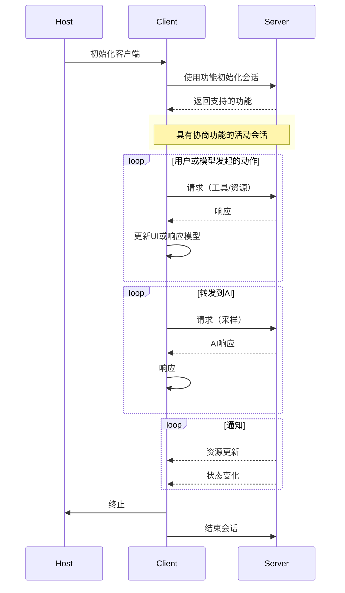

# 多角度深度解析MCP

* [MCP概念引入](#MCP概念引入)
* [MCP的核心技术](#MCP的核心技术)
* [MCP的应用场景](#MCP的应用场景)
* [MCP的未来趋势](#MCP的未来趋势)
* [结束语](#结束语)

## MCP概念引入
### 概念

- Model Context Protocol (MCP)是开放协议，实现LLM与外部数据源和工具集成。MCP标准化LLM获取上下文信息的方式，定义权威性要求，基于TypeScript方案。实现指南和示例见[modelcontextprotocol.io](https://modelcontextprotocol.io)。术语解释遵循BCP 14 [RFC2119] [RFC8174]。
- MCP标准化应用共享上下文信息、公开工具和构建工作流。使用JSON-RPC 2.0消息通信，包括主机、客户端和服务器。MCP受LSP启发，标准化AI应用中的上下文和工具集成。
- 基础协议使用JSON-RPC，支持有状态连接和功能协商。服务器提供资源、提示和工具，客户端提供采样。
- 附加工具支持包括配置管理、进度跟踪、任务取消、错误报告和日志记录。
- 安全性与信任考虑包括用户同意、数据隐私、工具安全和LLM采样控制。实现者应构建用户同意流程，记录安全性影响，实施访问控制和数据保护，遵循安全最佳实践，考虑隐私影响。

### MCP的起源
MCP起源于2023年初，当时一些人工智能研究者着手探索如何高效处理模型上下文信息。经过一年多的努力，他们在2024年11月推出了模型上下文协议（MCP）。这一新技术迅速在开发者和AI社区中获得关注，被视为解决模型理解和应用问题的关键。

### MCP的发展历程
自推出以来，MCP迅速发展。最初，它用于优化客户端体验，例如提升聊天机器人对话的自然度。随后，MCP在服务端的大数据处理和分析中得到了广泛应用。目前，MCP已拓展至自然语言处理、计算机视觉和强化学习等领域，并在个性化推荐、内容生成及决策支持等方面展现出巨大潜力。

### MCP前景预测
意图理解，实现人类意图到物理世界的闭环。 MCP有潜力成为连接人工智能与现实世界的关键桥梁，提高模型理解力，推动人机交互创新。然而，其发展也面临诸多挑战，如隐私、数据安全和伦理问题。

## MCP的核心技术

### 技术原理
MCP基于JSON-RPC 2.0协议，采用TypeScript方案。MCP的核心技术包括：http sse，用于实时数据流传输。MCP还支持有状态连接和功能协商，以实现更智能的模型。

### 技术组件

#### 主机
主机进程充当容器和协调器：
- 创建和管理多个客户端实例
- 控制客户端连接权限和生命周期
- 强制实施安全策略和同意要求
- 处理用户授权决策
- 协调 AI/LLM集成和采样
- 管理跨客户端的上下文聚合
- 
#### 服务端
服务器提供专门的上下文和功能：
- 通过 MCP 原语公开资源、工具和提示
- 独立运营，职责集中
- 通过客户端接口请求采样
- 必须遵守安全约束
- 可以是本地进程或远程服务

#### 客户端
每个客户端都由主机创建，并维护一个隔离的服务器连接：
- 为每个服务器建立一个有状态会话
- 处理协议协商和能力交换
- 双向路由协议消息
- 管理订阅和通知
- 维护服务器之间的安全边界

#### 能力协商

Model Context Protocol 使用基于功能的协商系统，其中客户端和服务器在初始化期间显式声明其支持的功能。功能确定在会话期间哪些协议功能和基元可用。

- **服务器声明的功能**
    - 资源订阅
    - 工具支持
    - 提示模板

- **客户端声明的功能**
    - 采样支持
    - 通知处理

- **协商规则**
    - 双方必须在整个会话期间尊重声明的能力。
    - 可以通过协议的扩展来协商其他功能。

- **功能解锁的具体协议特性**
    - 已实施的服务器功能必须在服务器的功能中公布。
    - 发出资源订阅通知需要服务器声明订阅支持。
    - 工具调用要求服务器声明工具功能。
    - 采样要求客户端声明其功能中的支持。

此功能协商可确保客户端和服务器清楚地了解支持的功能，同时保持协议的可扩展性。

### 技术优势
1. **标准化的上下文集成**
  - MCP 提供了一种标准化的方式，使 LLM（大语言模型）能够与外部数据源和工具进行高效集成。通过定义权威性的要求和基于 TypeScript 的方案，MCP 简化了上下文信息的获取和处理。

1. **基于 JSON-RPC 2.0 的通信协议**
  - 使用 JSON-RPC 2.0 作为基础通信协议，支持有状态连接和功能协商。这种设计使得 MCP 能够在客户端和服务器之间实现高效的双向消息传递，同时保持协议的灵活性和扩展性。

1. **模块化架构**
  - MCP 的架构分为主机、客户端和服务端三个主要组件：
    - **主机**：负责协调多个客户端实例，管理权限和生命周期，并实施安全策略。
    - **服务端**：专注于提供特定的上下文和功能，如资源、工具和提示。
    - **客户端**：为每个服务器建立独立的会话，处理协议协商和能力交换。
  - 这种模块化设计提高了系统的可维护性和可扩展性。

1. **功能协商机制**
  - MCP 引入了基于功能的协商系统，在初始化期间明确声明客户端和服务器支持的功能。这种机制确保双方清楚了解支持的能力，同时允许通过协议扩展来引入新功能。

1. **实时数据流传输**
  - 支持 HTTP SSE（Server-Sent Events）用于实时数据流传输，使 MCP 能够高效处理动态更新的上下文信息。

1. **安全性与信任保障**
  - MCP 在设计中考虑了用户同意、数据隐私、工具安全和 LLM 采样控制等安全性问题。实现者需要构建用户同意流程，记录安全性影响，并遵循最佳实践以保护数据隐私。

1. **跨领域适用性**
  - MCP 不仅适用于优化客户端体验（如提升聊天机器人对话的自然度），还在服务端的大数据分析、自然语言处理、计算机视觉和强化学习等领域展现出广泛应用潜力。

1. **灵活的传输层支持**
  - MCP 支持多种传输方式，包括标准输入输出（Stdio）、SSE 和 WebSocket，满足不同场景下的通信需求。

1. **强大的工具支持**
  - 提供附加工具支持，包括配置管理、进度跟踪、任务取消、错误报告和日志记录等功能，增强了开发者的使用体验。

这些技术优势使得 MCP 成为一种强大且灵活的协议，能够在 AI 应用中实现高效的上下文和工具集成，推动人机交互创新和模型理解力的提升。

## MCP的应用场景

在各个领域中，MCP 的应用场景包括：提高 AI 应用的效率和准确性, 优化 AI 应用的体验和用户体验。

- **应用案例**：
  - Zed 编辑器通过 MCP 协议与 PostgreSQL 数据库集成，提供实时的上下文信息。
  - 当用户输入 SQL 查询时，MCP 可以检测光标位置并提供相关建议，例如表名或列名的自动完成。

- **应用效果**：
  - 提高了 SQL 编写的效率和准确性。
  - 减少了因错误表名或列名导致的查询失败。

- **应用前景**：
  - 随着 MCP 的普及，更多编辑器和 IDE 将支持类似的数据库集成功能。
  - 未来可能扩展到其他类型的数据库（如 MongoDB、Redis 等）。

## MCP的未来趋势

### MCP的技术发展趋势

#### 技术创新
1. **一键接入功能**：MCP引入了独特的"一键接入"技术，允许开发者只需少量代码即可快速集成MCP到现有系统中。这项创新大大降低了使用门槛，加速了MCP的普及和应用。
2. **全面的消息支持**：MCP最初仅支持文本和图片消息，现已扩展至音频消息，并计划在未来支持视频消息。这种全媒介支持使得MCP能够处理更复杂、更多样化的数据交互需求。
3. **实时性增强**：通过优化算法和协议设计，MCP实现了更低的延迟和更高的吞吐量，确保了数据传输的及时性和可靠性。

#### 技术融合
1. **HTTP集成**：MCP巧妙地利用HTTP协议的普遍性和成熟性，同时在其基础上进行了必要的扩展和优化，以适应更复杂的场景需求。
2. **OAuth认证**：通过集成OAuth 2.0标准，MCP提供了强大的身份验证和授权机制，确保了数据传输的安全性。
3. **无状态服务实现**：MCP采用了无状态的服务架构，这不仅提高了系统的可扩展性，还增强了系统的容错能力。

#### 技术普及
MCP因其灵活性、易用性和强大的功能，得到了广泛的认可和支持。目前，包括OpenAI、 Anthropic 在内的多家科技巨头都在其产品和服务中集成了MCP。

## 结束语

### 感谢您的关注与支持再见

